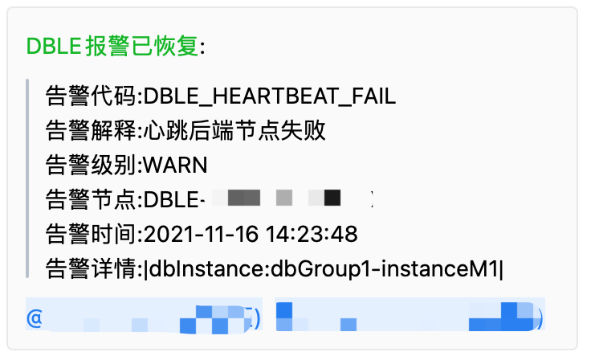
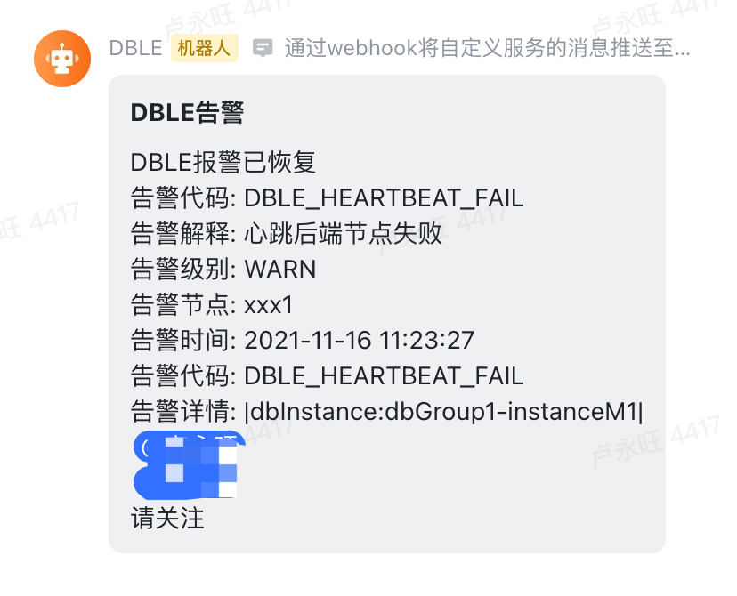

# DBLE监控告警组件

## 背景

公司内部使用了大量的DBLE实例统一代理众多mysql实例, 为了增强业务稳定性第一时间可以了解到相关告警. 保证各个业务自身的状态,支持不同dbGroup实例分发到不同的告警机器人.

## 实现原理

参考文档: https://actiontech.github.io/dble-docs-cn/1.config_file/1.11_customized_alert.html

通过DBLE的回调事件,实现通知下发

## 使用方式

### 一、下载并安装

     Github地址: https://github.com/LuYongwang/dble-alram-webhook/releases

	 下载jar包,放到lib目录下, 该jar包无任何三方依赖, 所有依赖项均为DBLE已有依赖 不会影响DBLE稳定性

### 二、配置

#### 1、配置文件配置

```shell
vim $DBLE_HOME/config/dble_alert.properties
```

#### 2、配置文件详解与案例

##### 企业微信

```properties
# 固定写法
alert=io.github.luyongwang.dble.WebHookAlarmAlert
# 告警中的节点名称
component_id=DBLE-10.0.142.11
# 企业微信告警 (必须)
web_hook.type=WORK_WECHAT
# 企业微信 全局默认机器人ID (必须)
web_hook.robot_id=xxxx-xxxx-xxxx-xxxx-xxxxxx
# db负责人以及告警配置 dbGroup1 为 db.xml 中的 dbgroup节点name principal是负责人告警中会@ ,多个隔开
web_hook.db_config.dbGroup1.principal=xxxxx,xxxxx
# robot_id 在一些场景下 想把告警单独分发到某个机器人 可以设置 不设置默认为 全局默认机器人ID
web_hook.db_config.dbGroup1.robot_id=xxxx-yyyy-zzzz-xxxx-yyyy

```


##### 钉钉配置

```properties
# 固定写法
alert=io.github.luyongwang.dble.WebHookAlarmAlert
# 告警中的节点名称
component_id=DBLE-10.0.142.11
# 钉钉告警
web_hook.type=DING_TALK
# 钉钉机器人ID
web_hook.robot_id=xxxxxxxxxxx
# 这里输入手机号
web_hook.db_config.dbGroup1.principal=150xxxxxxxx,132xxxxxxxx
# robot_id 在一些场景下 想把告警单独分发到某个机器人 可以设置 不设置默认为 全局默认机器人ID
web_hook.db_config.dbGroup1.robot_id=xxxxxxxxxxxxxxxxxxxxxxxxxxx
```

##### 飞书配置

```properties
# 入口
alert=io.github.luyongwang.dble.WebHookAlarmAlert
# 告警中的节点名称
component_id=DBLE-10.0.142.11
# WEBHOOK配置
web_hook.type=FEI_SHU
# 飞书全局机器人ID
web_hook.robot_id=xxxx-xxxx-xxxx-xxxx-xxxx
# db负责人以及告警配置 dbGroup1 为 db.xml 中的 dbgroup节点name principal是负责人告警中会@ ,多个隔开 这里输入userid
web_hook.db_config.dbGroup1.principal=xxxxxx,xxxxx
# robot_id 在一些场景下 想把告警单独分发到某个机器人 可以设置 不设置默认为 全局默认机器人ID
web_hook.db_config.dbGroup1.robot_id=xxxx-xxxxx-xxxx-xxxx-xxxx

```

##### 自定义WebHook配置

```properties
# 入口
alert=io.github.luyongwang.dble.WebHookAlarmAlert
# 告警中的节点名称
component_id=DBLE-10.0.142.11
# WEBHOOK配置
web_hook.type=URL
web_hook.hook_url=http://xxxxxxxx/api/v1/robot/msg/send
web_hook.hook_params=robot_id=xxxx-xxxx-xxxx-xxxxxx
web_hook.db_config.dbGroup1.principal=150xxxxxx,132xxxxxx
web_hook.db_config.dbGroup1.hook_params=robot_id=xxx-xxx-xxxx-xxxx-xxxx

```

自定义webHook 请求示例 webHook接口自行实现
``` bash
curl '{hook_url}?{hook_params}' \
   -H 'Content-Type: application/json' \
   -d '
   {
        "msgtype": "markdown",
        "markdown": {
            "content": "<font color='warning'>DBLE告警消息</font>:\n >告警代码:DBLE_HEARTBEAT_FAIL\n >告警解释:心跳后端节点失败\n >告警级别:WARN\n >告警节点:xxx\n >告警时间:2020-10-15 21:48:11\n >告警详情:|dbInstance:dbGroup1-instanceM1|"
        },
        # 手机号方便@等
        "mobile_list": ["150xxxxxx","132xxxxxx"]
   }'
```

#### 效果图




